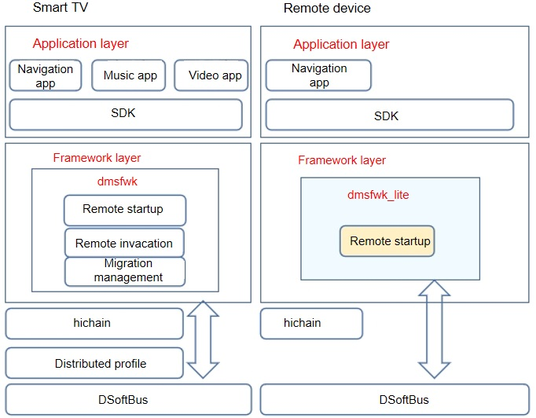

# dmsfwk_lite

## Introduction

The Lite Distributed Ability Manager Service Framework (dmsfwk_lite) component provides the capability of starting Feature Abilities (FAs) across devices and supports application collaboration in distributed scenarios. The following figure shows the architecture of dmsfwk_lite.



## Directory Structure

The table below describes the directory structure of the dmsfwk_lite source code.

**Table 1** Directory structure of the major source code

| Directory       | Description                |
| ----------- | -------------------- |
| dmsfwk_lite | Implementation of dmsfwk_lite|

The source code directory structure of dmsfwk_lite is as follows:

```
├── BUILD.gn
├── include
│  ├── dmslite.h        # Header file for the open APIs provided by dmsfwk_lite
│  ├── dmslite_check_remote_permission.h     # Header file for the permission management module of dmsfwk_lite
│  ├── dmslite_famgr.h                       # Header file for the FA management module of dmsfwk_lite
│  ├── dmslite_inner_common.h                # Internal common file of dmsfwk_lite
│  ├── dmslite.h                             # Header file for the implementation of the dmsfwk_lite service
│  ├── dmslite_log.h                         # Header file for the log module
│  ├── dmslite_parser.h                  # Header file for the distributed message parsing module
│  ├── dmslite_tlv_common.h                  # Header file for the TLV data parsing module
│  └── dmslite_session.h                     # Header file for the inter-device communication module
├── readme.md
├── LICENSE
├── source
    ├── distributed_schedule_service.c
    ├── dmslite.c
    ├── dmslite_check_remote_permission.c
    ├── dmslite_famgr.c
    ├── dmslite_msg_parser.c
    ├── dmslite_tlv_common.c
    └── dmslite_session.c
```

## Constraints

**Programming language**: C/C++

**Networking environment**: The local and remote devices must be on the same LAN and can ping each other.

**Operating system**: OpenHarmony

**Remote startup**:

-   Only FAs can be started remotely.
-   Before the remote startup, ensure that the distributed networking between the local and remote devices is successful. Otherwise, the remote startup fails.

## Usage

- **Building**

  The code of dmsfwk_lite is stored in the following directory:

  ```
  foundation/ability/dmsfwk_lite
  ```
  
  When building the code for a specific platform, you must specify the target platform.
  
  ```
  hb build
  ```

- **Local device development** (taking FA startup as an example)

  Create a **Want** instance to set the remote device ID, bundle name, and ability class name of the target FA and set the **Want.FLAG\_ABILITYSLICE\_MULTI\_DEVICE** flag to enable distributed startup.

  ```
  import ohos.aafwk.ability.Ability;
  import ohos.aafwk.content.Want;
  import ohos.bundle.ElementName;

  // Create a Want instance that will be passed to the startAbility method.
  Want want = new Want();
  ElementName name = new ElementName(remote_device_id,       "ohos.dms.remote_bundle_name", "remote_ability_name"); 
  want.setElement(name); // Add information about the target FA to the Want instance.
  want.setFlags(Want.FLAG_ABILITYSLICE_MULTI_DEVICE); // Set the multi-device startup flag. If this flag is not set, remote FA startup will be unavailable.

  // Start the remote FA on the remote device.
  startAbility(want); // Start the specified FA based on the want parameter. If the name and type of the want parameter are different from those used in DevEco Studio, use the parameter name and type in DevEco Studio.
  ```

- **Prerequisites**

  The target FA with the specified bundle name must have been installed on the remote device.

- **Execution** (taking FA startup as an example)

  Call the **startAbility** method on the local device to start the target FA on the remote device.

## Repositories Involved

dmsfwk_lite

[**dmsfwk\_lite**](https://gitee.com/openharmony/ability_dmsfwk_lite)
